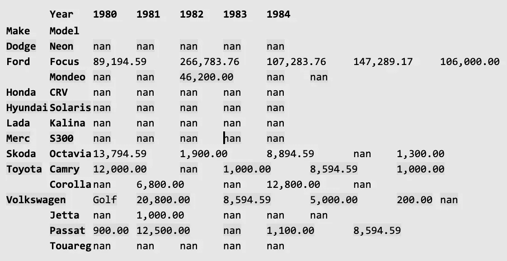

# Pandas: working with Dataframes

Summary: Today we will help you acquire skills with Pandas.

## Contents

1. [Chapter I](#chapter-i) \
    1.1. [Foreword](#foreword)
2. [Chapter II](#chapter-ii) \
    2.1. [Instructions](#instructions)
3. [Chapter III](#chapter-iii) \
    3.1. [Specific instructions for the day](#specific-instructions-for-the-day)
4. [Chapter IV](#chapter-iv) \
    4.1. [Exercise 00 : Load and save](#exercise-00-load-and-save)
5. [Chapter V](#chapter-v) \
    5.1. [Exercise 01 : Basic operations](#exercise-01-basic-operations)
6. [Chapter VI](#chapter-vi) \
    6.1. [Exercise 02 : Preprocessing](#exercise-02-preprocessing)
7. [Chapter VII](#chapter-vii) \
    7.1. [Exercise 03 : Selects and aggregations](#exercise-03-selects-and-aggregations)
8. [Chapter VIII](#chapter-viii) \
    8.1. [Exercise 04 : Enrichment and transformations](#exercise-04-enrichment-and-transformations)
9. [Chapter IX](#chapter-ix) \
    9.1. [Exercise 05 : Pandas optimizations](#exercise-05-pandas-optimizations)
    
   
## Chapter I

### Foreword

Fun facts about pandas:

* Pandas are big eaters – every day they fill their tummies for up to 12 hours, consuming up to 12 kilograms of bamboo
* Unlike most other bears, pandas do not hibernate. When winter approaches, they
head lower down their mountain homes to warmer temperatures, where they continue to chomp away on bamboo
* Sadly, these beautiful bears are endangered, and it’s estimated that only around
1,000 remain in the wild
* On average, pandas poo 40 times a day
* According to legend, the panda was once an all-white bear. When a small girl tried
to save a panda cub from being attacked by a leopard, the leopard killed the girl
instead. Pandas came to her funeral wearing armbands of black ashes. As they
wiped their eyes, hugged each other, and covered the ears, they smudged the black
ashes into their fur.
* A panda’s entire mating process takes about two or three days. Once they have
mated, the females chase the males out of their territory and raise their cubs on
their own
* A giant panda usually gives birth to a single cub. Sometimes twins are born, but
when this happens, the mother typically ignores the weaker cub. She does not have
enough energy to care for two cubs
* A giant panda’s face is cute, but it is not chubby. It gets its shape from massive
cheek muscles
* Keeping even a single panda in a zoo is expensive. A panda costs five times more
to keep than the next most expensive animal, an elephant
* If you think that any of this is relevant to the library Pandas, you needn’t. The
name is derived from the term "panel data", an econometrics term for data sets that
include observations over multiple time periods for the same individuals

## Chapter II

### Instructions

* Use this page as your only reference. Do not listen to any rumors or speculations
about how to prepare your solution.
* Here and further on we use Python 3 as the only correct version of Python.
* The solutions for python exercises (d01, d02, d03) must have the following block in
the end: ```if __name__ == ‘__main__’```.
* Pay attention to the permissions of your files and directories.
* To be assessed your solution must be in your GIT repository.
* Your solutions will be evaluated by your piscine peers.
* You should not leave any additional files in your directory other than those explicitly
specified in the subject. It is recommended that you modify your .gitignore to avoid
any accidents.
* Your solution must be in your GIT repository for evaluation. Always push only to the develop branch! The master branch will be ignored. Work in the src directory.
* When you need to get precise output in your programs, it is forbidden to display a
precalculated output instead of performing the exercise correctly.
* Have a question? Ask your neighbor on the right. If that fails, try your neighbor
on the left.
* Your reference material: peers / Internet / Google.
* You can ask questions in Slack.
* Read the examples carefully. They may require things that are not otherwise specified in the subject.
* And may the Force be with you!

## Chapter III

### Specific instructions for the day

* Use Jupyter Notebook to work with your code
* For each major subtask in the list of any exercise (black bullets), your `ipynb` file
should have an `h2` heading to help your peer easily navigate in your code
* No imports are allowed, except those explicitly mentioned in the “Authorized functions” section of the title block of each exercise
* You can use any built-in function, if it is not prohibited in the exercise
* Save and load all the required data in the subfolder `data/`

## Chapter IV

### Exercise 00 : Load and save

Exercise 00

Load and save

Turn-in directory : ex00/

Files to turn in : load_and_save.ipynb

Allowed functions : import pandas as pd

Congratulations! Five days and one rush are behind you. They were dedicated to
building good fundamental skills in working with Python. Now you know all the basic
data types, useful built-in functions, how to work with a virtual environment, how to use
OOP, how to use logging, how to parse data from websites, and how to send messages in
a Slack channel. In the following week, we will be more focused on data science. It will
be a week full of Pandas exercises. Pandas is one of the most popular and useful libraries
in the field. You will love it too!

In this exercise, you will need to load the [log file](https://drive.google.com/file/d/1kgByP3EZHL8xAm-oGaBpf0-fPdVIYRaY/view) (put it in the directory `data` in the
src directory of the day) into a dataframe, change the delimiter, and save it to another
file.

The task is:

* `read_csv`:
  * filter the rows with index 2 and 3 using the argument skiprows, we know that
  these observations were fake
  * filter the last 2 rows from the footer using the argument skipfooter, we know
  that these observations were fake too
  * assign the following names to the column: `datetime`, `user`
  * use datetime as the index column
* rename `datetime` to `date_time`
* to_csv:
  * use `’;’` as the delimiter
  * save it to a file with the name `feed-views-semicolon.log`

As the result of `read_csv`, you need to achieve the following:

```
In [3]: df.head()
Out[3]:
user
datetime
2020-04-17 12:01:08.463179 artem
2020-04-17 12:01:23.743946 artem
2020-04-17 12:35:52.735016 artem
2020-04-17 12:36:21.401412 oksana
2020-04-17 12:36:22.023355 oksana

In [4]: df.tail()
Out[4]:
user
datetime
2020-05-21 16:36:40.915488 ekaterina
2020-05-21 17:49:36.429237 maxim
2020-05-21 18:45:20.441142 valentina
2020-05-21 23:03:06.457819 maxim
2020-05-21 23:23:49.995349 pavel
```

Think about how many lines of code you would have needed to write if you had had
to do it without Pandas

## Chapter V

### Exercise 01 : Basic operations

Exercise 01

Basic operations

Turn-in directory : ex01/

Files to turn in : basic_operations.ipynb

Allowed functions : import pandas as pd

We are confident that you understand that this is not everything that Pandas can do
for you. Let us go deeper and wider.

In this exercise, you will work with a single log of users who visited a page, including
their timestamps.

* create a dataframe `views` with two columns: `datetime` and `user` by reading `feed-views.log`
  * convert the `datetime` to the `datetime64[ns]` `Dtype`
  * extract the year, month, day, hour, minute, and second from the values of that
  column to the new columns
* create the new column `daytime`
  * you need to assign the particular time of day value if an hour is within a
  particular interval, for example, afternoon if the hour is larger than `11` and
  less or equal to `17`
  * 0 – 3.59 `night`, 4 – 6.59 `early morning`, 7 – 10.59 `morning`, 11 – 16.59 `afternoon`, 17 – 19.59 `early evening`, 20 – 23.59 `evening`
  * use the method `cut` to solve this subtask
  * assign the column `user` as the index
* calculate the number of elements in your dataframe
  * use the method `count()`
  * calculate the number of elements in each time of day category using the method
  `value_counts()`
* sort values in your dataframe by hour, minute, and second in ascending order
  (simultaneously and not one by one)
* calculate the minimum and maximum for the hours and the mode for the daytime
  categories
  * calculate the maximum of hour for the rows where the time of day is night
  * calculate the minimum of hour for the rows where the time of day is morning
  * In addition to this, find out who visited the page at those hours (make one
  example from that)
  * calculate the mode for the hour and daytime
* show the 3 earliest hours in the morning and the corresponding usernames and the
  3 latest hours and the usernames using `nsmallest()` and `nlargest()`
* use the method `describe()` to get the basic statistics for the columns
  * to find out what the most popular interval for visiting the page is, calculate
    the interquartile range for the hour by extracting values from the result of the
`describe()` method and store it in the variable `iqr`

## Chapter VI

### Exercise 02 : Preprocessing

Exercise 02

Preprocessing

Turn-in directory : ex02/

Files to turn in : preprocessing.ipynb

Allowed functions : import pandas as pd

One day you will train machine learning models (no later than this week), but most
of them require the data to be clean and enriched: without duplicates or missing values.
Pandas is a great tool to do this. It gives you the tools not only to perform descriptive
analysis and understand your data better but to preprocess it too. That is what you are
going to do in this exercise.

* [download](https://drive.google.com/open?id=1kFMUiXtrlw5B6WTjJ-mUm4-STV28Zsvn) and read the CSV file and make `ID` the index column
* count the number of observations using the method `count()`
* drop the duplicates, taking into account only the following columns: `CarNumber`,
`Make_n_model`, `Fines` 
  * between the two equal observations, you need to choose the last
  * check the number of observations again
* work with missing values
  * check how many values are missing from each column
  * drop all the columns with over 500 missing values using the argument `thresh`,
  check how many missing values are in each column
  * replace all the missing values in the `Refund` column with the previous value in
  that column for that cell, use the argument method, check how many values
  are missing from each column
  * replace all the missing values in the `Fines` column with the mean value of this
  column (exclude NA/null values when computing the mean value), check how
  many values are missing from each column
* split and parse the make and model
  * use the method apply both for splitting and for extracting the values to the
  new columns `Make` and `Model`
  * drop the column `Make_n_model`
  * save the dataframe in the JSON file auto.json in the format below:

    ```
    [{"CarNumber":"Y163O8161RUS","Refund":2.0,"Fines":3200.0,"Make":"Ford",
    "Model":"Focus"},
    {"CarNumber":"E432XX77RUS","Refund":1.0,"Fines":6500.0,"Make":"Toyota",
    "Model":"Camry"}]
    ```

## Chapter VII

### Exercise 03 : Selects and aggregations

Exercise 03

Selects and aggregations

Turn-in directory : ex03/

Files to turn in : selects_n_aggs.ipynb

Allowed functions : import pandas as pd

Ok, great. Now we have cleaned our data: all the duplicates have been dropped, all
the missing values have been deleted, and our columns have been reorganized to be more
convenient for analysis. Now we can go further. We have a lot of questions that need to
be answered.

* load the JSON file that you created in the previous exercise into a dataframe 
  * set `CarNumber` as the index column
* make the following selects
  * display the rows only where the `fines` are more than `2,100`
  * display the rows only where the `fines` are more than `2,100` and the `refund`
  equals `2`
  * display the rows only where the `models` are from the list: `````[’Focus’, ’Corolla’]`````
  * display the rows only where the car number is from the list: 
  ```[’Y7689C197RUS’, ’92928M178RUS’, ’7788KT197RUS’, ’H115YO163RUS’, ’X758HY197RUS’]```
* make the aggregations with the make and the model
  * display the median `fines` grouped by the `make`
  * display the median `fines` grouped by the `make` and the `model`
  * display the number of `fines` grouped by the `make` and the `model` in order to
  understand if we can trust the median values
  * display the minimum and the maximum `fines` grouped by the `make` and the
  `model` in order to better understand the variance
  * display the standard deviation of the `fines` grouped by the `make` and the `model`
  in order to better understand the variance
* make the aggregations with the car number
  * display the car numbers grouped by the number of the `fines` in descending
  order, we want to find those who most often violated the law
  * select from the initial dataframe all the rows corresponding to the top-1 car
  number, we want to zoom in a little bit
  * display the car numbers grouped by the sum of the `fines` in descending order,
  we want to find those who paid the most
  * select from the initial dataframe all the rows corresponding to the top-1 car
  number, we want to zoom in a little bit
  * display a table that answers the question: are there any car numbers that were connected to different models?

## Chapter VIII

### Exercise 04 : Enrichment and transformations

Exercise 04

Enrichment and transformations

Turn-in directory : ex04/

Files to turn in : enrichment.ipynb

Allowed functions : import pandas as pd, import numpy as np, import requests

Cool. But the more data you have the better the analysis you can conduct. Let us
enrich our initial dataset.

* read the JSON file that you saved in `ex02`

  * one of the columns has the float type, so let us define the format of it in
  pandas using `pd.options.display.float_format`: floats should be displayed with
  two decimals
  * there are values missing from the Model, do not do anything with them
* enrich the dataframe using a sample from that dataframe
  * create a sample with 200 new observations with `random_state = 21` 
    * the sample should not have new combinations of the `car number`,
    `make` and `model`, so the whole dataset will be consistent in these terms
    * there are no restrictions on the `refund` and `fines`, you can take
    any value
    from these columns at random and use it towards any car number
  * concatenate the sample with the initial dataframe to a new dataframe `concat_rows`
* enrich the dataframe `concat_rows` by a new column with the data generated 
  * create a series with the name `Year` using random integers from `1980` to `2019`
  * use `np.random.seed(21)` before generating the years
  * concatenate the series with the dataframe and name it `fines`
* enrich the dataframe with the data from another dataframe
  * create a new dataframe with the car numbers and their owners
      * get the most popular surnames (**you can find the file [surname.json](datasets/surname.json) in the attachments**) in the US
      * create a new series with the surnames (they should not have
      special characters like commas, brackets, etc.) from the data you gathered, the count
      should be equal to the number of unique car numbers using the sample
      (use `random_state = 21`)
      * create the dataframe owners with 2 columns: `CarNumber` and
`SURNAME` 
  * append 5 more observations to the fines dataframe (come up with your own
ideas of CarNumber, etc.)
  * delete the dataframe last `20` observations from the owners and add 3 new
observations (they are not the same as those you add to the `fines` dataframe)
  * join both dataframes:
    * the new dataframe should have **only** the car numbers that exist in **both** dataframes 
    * the new dataframe should have **all** the car numbers that exist in **both** dataframes 
    * the new dataframe should have only the car numbers from the `fines` dataframe 
    * the new dataframe should have only the car numbers from the `owners` dataframe
* create a pivot table from the `fines` dataframe, it should look like this (the values are
the sums of the fines), but with all the years (the values may be different for you):

    

* save both the `fines` and `owners` dataframes to CSV files without an index

## Chapter IX

### Exercise 05 : Pandas optimizations

Exercise 05

Pandas optimizations

Turn-in directory : ex05/

Files to turn in : optimizations.ipynb

Allowed functions : import pandas as pd, import gc

We are returning to the idea of code efficiency. By now you know the basics of Pandas.
It is time to get to know some cool stuff that most Pandas users neither use nor know
about.

* read the fines.csv that you saved in the previous exercise
* iterations: in all the following subtasks, you need to calculate `fines/refund*year` for
each row and create a new column with the calculated data and measure the time
using the magic command `%%timeit` in the cell
  * loop: write a function that iterates through the dataframe using `for i in
  range(0, len(df))`, `iloc` and `append()` to a list, assign the result of the function to a new column in the dataframe
  * do it using `iterrows()`
  * do it using `apply()` and lambda function
  * do it using `Series` objects from the dataframe
  * do it as in the previous subtask but with the method `.values`
* indexing: measure the time using the magic command `%%timeit` in the cell
  * get a row for a specific `CarNumber`, for example, `’O136HO197RUS’`
  * set the index in your dataframe with `CarNumber`
  * again, get a row for the same `CarNumber`
* downcasting:
  * run `df.info(memory_usage=’deep’)`, pay attention to the `Dtype` and the memory usage
  * make a `copy()` of your initial dataframe into another dataframe `optimized`
  * downcast from `float64` to `float32` for all the columns
  * downcast from `int64` to the smallest numerical dtype possible
  * run `info(memory_usage='deep')` for your new dataframe, pay attention to the Dtype and the memory usage
* categories:
  * change the `object` type columns to the type `category`
  * This time, check the memory usage, it probably has a decrease of 2–3 times compared to the initial dataframe
* memory clean
  * using `%reset_selective` and the library `gc` clean the memory of your initial dataframe only


this readme is s21 property